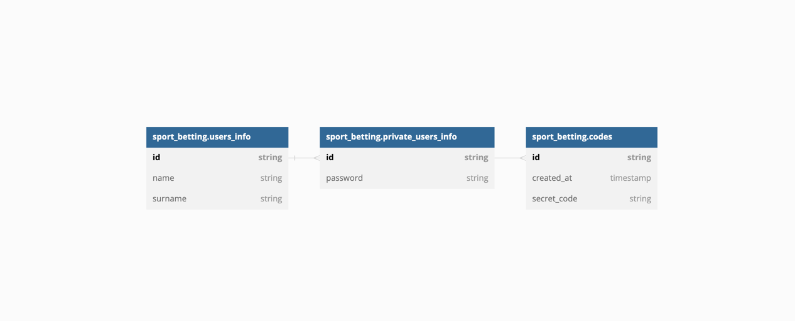
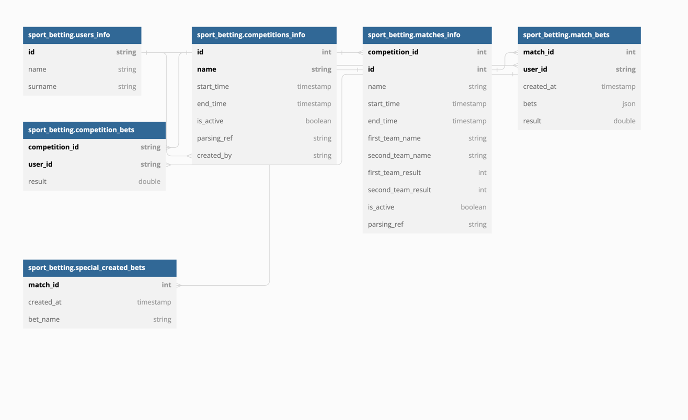

# Запуск
заполнить переменные окружения, используемые в docker-compose
сделать docker-compose build && docker-compose up

для запуска фронта надо в папке с фронтом прописать команду npm build


# Авторизация
Шифруем телеграмм-ник на уровне бэкенда, хэшируем пароль на уровне фронта. Везде далее во всех ручках проверяем авторизацию при помощи Oauth
## Ручки
```
/user/register:
        post:
            description: Регистрирует пользователя с заданными данными.
            parameters:
              - in: body
                name: body
                required: true
                schema:
                    $ref: '#/definitions/UserInfo'
            responses:
                '200':
                    description: Удачная попытка регистрации
                '400':
                    description: Ошибка при валидации параметров (например, попытка повторной регистрации)
                    schema:
                        $ref: '#/definitions/ErrorResponse'
                        
/user/login:
        post:
            description: Залогинивает пользователя с заданными данными.
            parameters:
              - in: body
                name: body
                required: true
                schema:
                    $ref: '#/definitions/BaseUserInfo'
            responses:
                '200':
                    description: Удачная попытка логина
                '400':
                    description: Ошибка при валидации параметров
                    schema:
                        $ref: '#/definitions/ErrorResponse'
                '404':
                    description: Пользователь не найден
                    schema:
                        $ref: '#/definitions/ErrorResponse'
                        
/user/register/approve:
        post:
            description: Подтверждает регистрацию пользователя (страница с вводом слова регистрации).
            parameters:
              - in: body
                name: body
                required: true
                schema:
                    $ref: '#/definitions/RegisterApprove'
            responses:
                '200':
                    description: Удачное подтверждение
                    schema:
                        $ref: '#/definitions/UserInfo'
                '400':
                    description: Ошибка при валидации параметров
                    schema:
                        $ref: '#/definitions/ErrorResponse'
                '404':
                    description: Неверное кодовое слово
                    schema:
                        $ref: '#/definitions/ErrorResponse'
                        
/user:
        put:
            description: Изменение информации о пользователе.
            parameters:
              - in: body
                name: body
                required: true
                schema:
                    $ref: '#/definitions/UserMeta'
              - in: query
                name: id
                required: true
            responses:
                '200':
                    description: Удачное изменение
                    schema:
                        $ref: '#/definitions/UserInfo'
                '400':
                    description: Ошибка при валидации параметров
                    schema:
                        $ref: '#/definitions/ErrorResponse'
                '404':
                    description: Пользователь не найден
                    schema:
                        $ref: '#/definitions/ErrorResponse'
                        
        post:
            description: Выдача информации о пользователе
            parameters:
              - in: query
                name: id
                required: true
            responses:
                '200':
                    schema:
                        $ref: '#/definitions/UserInfo'
                '400':
                    description: Ошибка при валидации параметров
                    schema:
                        $ref: '#/definitions/ErrorResponse'
                '404':
                    description: Пользователь не найден
                    schema:
                        $ref: '#/definitions/ErrorResponse'
definitions:
       UserMeta:
           type: object
           required:
             - password
             - name
             - surname
           properties:
               name:
                   type: string
               surname:
                   type: string
               password:
                   type: string

       UserInfo:
           type: object
           required:
             - user_meta
             - id
           properties:
               user_meta:
                   $ref: '#/definitions/UserMeta'
               id:
                   type: string
                   
       BaseUserInfo:
           type: object
           required:
             - id
             - password
           properties:
               id:
                   type: string
               password:
                   type: string
                   
       RegisterApprove:
           type: object
           required:
             - secret_code
             - id
           properties:
               id:
                   type: string
               secret_code:
                   type: string
                   
       ErrorResponse:
           type: object
           required:
             - code
             - text
           properties:
               code:
                   type: string
               text:
                   type: string 
```
## Схема базы данных

https://dbdiagram.io/d/63b33f527d39e42284e8820d
```
Table sport_betting.users_info {
  id string [unique, not null]
  name string
  surname string
  Indexes {
    (id) [pk]
  }
}

Table sport_betting.private_users_info {
  id string [unique, not null, ref: > sport_betting.users_info.id]
  password string [not null]
  Indexes {
    (id) [pk]
  }
}

Table sport_betting.codes {
  id string [unique, not null, ref: > sport_betting.users_info.id]
  created_at timestamp [default: `now()`]
  secret_code string [not null]
  Indexes {
    (id) [pk]
  }
}
```
## Соотношение клиентского вида и бэкенд действий
Со стороны пользователя процесс регистрации выглядит следующим образом:
1) На начальной странице пользователю будет предложена форма с возможностью ввода имени, фамилии и телеграм-ника. При вводе пользователем этих данных, его телеграм-ник будет подвержен шифрованию. Далее будет дернута ручка /user/register. Пользователя перенес на следующую страницу. Логика внутри ручки сделает запись в базу sport_betting.users_info с данными пользователя.
2) На данной странице пользователю будет предложена ссылка на телеграм-бота и будет выдано одно окно, в которое пользователь должен будет ввести выданное ботом секретное слово регистрации. У бота будет работать две команды: /start - для разрешения пользователю получений сообщений от бота и /get_code - после ввода второй команды пользователю будет выдано секретное слово, которое он должен будет ввести на странице регистрации. Бот внутри себя содержит под второй командой генерацию самого секретного слова и делания запись во вторую таблицу - sport_betting.codes. При введении кода на странице пользователем будет дергаться ручка /user/register/approve, доставаться последнее сгеренной для пользователя слово из таблицы с кодами и сверяться с тем, что ввел пользователь. Если записи совпадают, то будет сделана запись в sport_betting.private_users_info. Только с этого момента пользователь считается зарегистрированным
3) Пользователь по интерейфейсу может посмотреть информацию о себе - при переходе на данную страницу будет дергаться ручка /user (get) и на той же странице менять мета-информацию о себе с помощью метода put. 
4) Пользователь помимо регистрации имеет возможность входа благодаря паролю и айди через соотвсетвующую ручку (/user/login) и соотвествующую страницу, проверять наличие такого пользователя будем через нахождение соответствующей записи в таблице sport_betting.private_users_info
5) Считаем, что телеграм-ник является неизменным для пользователя и единственным однозначным идентификатором

# Соревнования
Вступление в соревнования будет работать по ссылке. Только создатель соревнования может сам поделиться ей с друзьями и  только так пользователь может вступить в него. Пока количество и виды ставок будут жестко ограничено, подсчет очков по ним будет захардокжен, поскольку непонятно как начислять баллы и задавать нормальную системы по кастомным ставкам
## Парсер
Подобновлять инфу с ссылок для парсинга будем раз в день, обновляем инфу о соревнованиях до момента завершения всех матчей соревнования, матчей - до момент авыставления счета. Проходимся по всем соревнованиям и матчам таблицы, где is_active == true и если что обновляем записи. При дергании ручек где есть фильтры по активности мероприятия так же обновляем инфу о всех мероприятиях
## Ручки
```
/competitions:
        get:
            description: Получает все соревнования пользователя.
            parameters:
              - in: query
                name: id
                required: true
                schema:
                    type: string
            responses:
                '200':
                    schema:
                        type: object
                        required:
                          - competitions
                        properties:
                            competitions:
                                type: array
                                items:
                                    $ref: '#/definitions/Competition'
                '400':
                    description: Ошибка при валидации параметров
                    schema:
                        $ref: '#/definitions/ErrorResponse'
                '404':
                    description: Пользователь не найден
                    schema:
                        $ref: '#/definitions/ErrorResponse'
                        
/competitions_info:
        post:
            description: Добавляет пользователя в участие в соревнование.
            parameters:
              - in: query
                name: competition_id
                required: true
                schema:
                    type: string
              - in: query
                name: id
                required: true
                schema:
                    type: string
            responses:
                '200':
                    schema:
                        $ref: '#/definitions/Competition'
                '400':
                    description: Ошибка при валидации параметров
                    schema:
                        $ref: '#/definitions/ErrorResponse'
                '404':
                    description: Пользователь или соревнование не найдены
                    schema:
                        $ref: '#/definitions/ErrorResponse'
        get:
            description: Отдает информаицю о соревновании для этого пользовтеля.
            parameters:
              - in: query
                name: competition_id
                required: true
                schema:
                    type: string
              - in: query
                name: id
                required: true
                schema:
                    type: string
            responses:
                '200':
                    schema:
                        $ref: '#/definitions/Competition'
                '400':
                    description: Ошибка при валидации параметров
                    schema:
                        $ref: '#/definitions/ErrorResponse'
                '404':
                    description: Пользователь или соревнование не найдены
                    schema:
                        $ref: '#/definitions/ErrorResponse'
                        
/match_info:
        get:
            description: Отдает информаицю о матче для этого пользовтеля.
            parameters:
              - in: query
                name: match_id
                required: true
                schema:
                    type: string
              - in: query
                name: id
                required: true
                schema:
                    type: string
            responses:
                '200':
                    schema:
                        $ref: '#/definitions/Match'
                '400':
                    description: Ошибка при валидации параметров
                    schema:
                        $ref: '#/definitions/ErrorResponse'
                '404':
                    description: Пользователь или соревнование не найдены
                    schema:
                        $ref: '#/definitions/ErrorResponse'
                        
/create/competition:
        post:
            description: Создает новое соревнование.
            parameters:
              - in: query
                name: id
                required: true
                schema:
                    type: string
              - in: body
                name: parsing_ref
                required: true
                schema:
                    type: string
            responses:
                '200':
                    schema:
                        $ref: '#/definitions/Competition'
                '400':
                    description: Ошибка при валидации параметров
                    schema:
                        $ref: '#/definitions/ErrorResponse'
                '404':
                    description: Пользователь или соревнование не найдены
                    schema:
                        $ref: '#/definitions/ErrorResponse'

/create/match:
        post:
            description: Создает новый матч.
            parameters:
              - in: query
                name: id
                required: true
                schema:
                    type: string
              - in: query
                name: competion_id
                required: true
                schema:
                    type: string
              - in: body
                name: parsing_ref
                required: true
                schema:
                    type: string
            responses:
                '200':
                    schema:
                        $ref: '#/definitions/Match'
                '400':
                    description: Ошибка при валидации параметров
                    schema:
                        $ref: '#/definitions/ErrorResponse'
                '404':
                    description: Пользователь или соревнование не найдены
                    schema:
                        $ref: '#/definitions/ErrorResponse'
                        
/create/bet:
        post:
            description: Делает ставку.
            parameters:
              - in: query
                name: id
                required: true
                schema:
                    type: string
              - in: query
                name: match_id
                required: true
                schema:
                    type: string
              - in: body
                required: true
                schema:
                    type: array
                    items:
                        $ref: '#/definitions/Bets'     
            responses:
                '200':
                    schema:
                        $ref: '#/definitions/Match'
                '400':
                    description: Ошибка при валидации параметров
                    schema:
                        $ref: '#/definitions/ErrorResponse'
                '404':
                    description: Пользователь или соревнование не найдены
                    schema:
                        $ref: '#/definitions/ErrorResponse'
                        
/create/special_bet:
        post:
            description: Создает специальную бинарную ставку для матча.
            parameters:
              - in: query
                name: id
                required: true
                schema:
                    type: string
              - in: query
                name: match_id
                required: true
                schema:
                    type: string
              - in: body
                required: true
                schema:
                    $ref: '#/definitions/BetSmallInfo'     
            responses:
                '200':
                    schema:
                        $ref: '#/definitions/Match'
                '400':
                    description: Ошибка при валидации параметров
                    schema:
                        $ref: '#/definitions/ErrorResponse'
                '404':
                    description: Пользователь или соревнование не найдены
                    schema:
                        $ref: '#/definitions/ErrorResponse'
                        
/get/special_bet:
        post:
            description: Получает специальные бинарные ставки для матча.
            parameters:
              - in: query
                name: id
                required: true
                schema:
                    type: string
              - in: query
                name: match_id
                required: true
                schema:
                    type: string   
            responses:
                '200':
                    schema:
                        type: array
                        items:
                          $ref: '#/definitions/BetSmallInfo'
                '400':
                    description: Ошибка при валидации параметров
                    schema:
                        $ref: '#/definitions/ErrorResponse'
                '404':
                    description: Пользователь или соревнование не найдены
                    schema:
                        $ref: '#/definitions/ErrorResponse'
/set/special_bet:
        post:
            description: Выставляет результат бинарной ставке.
            parameters:
              - in: query
                name: id
                required: true
                schema:
                    type: string
              - in: query
                name: match_id
                required: true
                schema:
                    type: string  
              - in: body
                required: true
                schema:
                    $ref: '#/definitions/BetSmallInfoRes' 
            responses:
                '200':
                    schema:
                        $ref: '#/definitions/Match'
                '400':
                    description: Ошибка при валидации параметров
                    schema:
                        $ref: '#/definitions/ErrorResponse'
                '404':
                    description: Пользователь или соревнование не найдены
                    schema:
                        $ref: '#/definitions/ErrorResponse'
definitions:
       BetSmallInfo:
           type: object
           required:
             - name
           properties:
             name: 
               type: string
       BetSmallInfoRes:
           type: object
           required:
             - name
             - result
           properties:
             name: 
               type: string
             result:
               type: double
       Match:
           type: object
           required:
             - id
             - name
             - first_team_result
             - second_team_result
             - first_team_name
             - second_team_name
           properties:
               id:
                   type: integer
               name:
                   type: string
               first_team_name:
                   type: string
               second_team_name:
                   type: string
               first_team_result:
                   type: integer
               second_team_result:
                   type: integer
               bets_result:
                   type: double
               user_bets:
                   type: array
                   items:
                       $ref: '#/definitions/Bets'

       Competition:
           type: object
           required:
             - name
             - id
             - is_active
             - matches
           properties:
               name:
                   type: string
               id:
                   type: integer
               is_active:
                   type: boolean
               matches:
                   type: array
                   items:
                       $ref: '#/definitions/Match'
               leader_board:
                   type: array
                   items:
                       #ref: '#/definitions/BetsResult'
       
       Bets:
           type: object
           required:
             - name
             - bet
           properties:
               name:
                   type: string
               bet:
                   type: integer
               bet_profit:
                   type: double
           
       BetsResult:
           type: object
           required:
             - user_id
             - result
           properties:
               user_id:
                   type: string
               result:
                   type: double
               bets:
                   type: array
                   items:
                       $ref: '#/definitions/Bets'
```
## Схема базы данных

https://dbdiagram.io/d/63b33edc7d39e42284e881f7
```
Table sport_betting.users_info {
  id string [unique, not null]
  name string
  surname string
  Indexes {
    (id) [pk]
  }
}

Table sport_betting.competitions_info {
  id int [unique, not null, increment]
  name string [not null]
  start_time timestamp [not null]
  end_time timestamp
  is_active boolean [default: true]
  parsing_ref string [not null]
  created_by string [not null, ref: > sport_betting.users_info.id]
  Indexes {
    (id, name) [pk]
  }
}

Table sport_betting.matches_info {
  competition_id int [unique, not null, ref: > sport_betting.competitions_info.id]
  id int [unique, not null, increment]
  name string [not null]
  start_time timestamp [not null]
  end_time timestamp
  first_team_name string [not null]
  second_team_name string [not null]
  first_team_result int
  second_team_result int
  is_active boolean [default: true]
  parsing_ref string
  Indexes {
    (competition_id, id) [pk]
  }
}

Table sport_betting.match_bets {
  match_id int [unique, not null, ref: > sport_betting.matches_info.id]
  user_id string [unique, not null, ref: > sport_betting.users_info.id]
  created_at timestamp [default: `now()`]
  bets json [not null]
  result double
  Indexes {
    (match_id, user_id) [pk]
  }
}
```
## Соотношение клиентского вида и бэкенд действий
### Создание соревнований
Создание соревнований происходит через парсинг определенной ссылки (можно поддержать несколько сайтов). После ввода в окно пользователем ссылки для парсинга будет дернута ручка /create/competition, внутри себя ручка скрывает логику записи в таблицу sport_betting.competitions_info инфы, которую мы распарсили со страницы соревнования, присваивания соревнованию айдишника, записи автора соревнования на место created_by и запсука таймера по обновлению и нфы о соревновании ежедневно. Также путем парсинга инфы о соревновании происходит заполнение данных только об уже известных матчах в matches_info и по каждому матчу также запускается таймер. Таймер по обнолвению инфы о соревнованиях при необходимости добавляет матчи, проверяет наличие новых и закрытых ставок в match_bets, исходя из данных пересчитывает значения для competition_bets. Считается, что нельзя поставить ставку на уже законченный ил начатый матч (смотрится поле is_active в matches_info). После создания соревнования отдается диплинк на ручку /competitions_info для вступления в соревнование, внутри себя эта ручка скрывает запись в таблицу sport_betting.competition_bets и возможность открытия формы для делания ставок
### Просмотр соревнований
Страница всех соревнований подгружается благодаря дерганию ручки /competitions, формально внутри себя представляет селект из таблицы sport_betting.competition_bets по user_id и из competitions_info по competition_id далее. Внутри себя ручка будет вызывать принудительное перепарсивание инфы с сайта о соревнованиях. Фильтр о действительных соревнованиях будет поддержен на уровне фронта благодаря возвращаему флагу is_active
### Просмотр соревнования
Админская или неадминская версия показывается человеку опредляется через поля created_by в таблице sport_betting.competitions_info, если текущий пользовательский айдишник равен авторскому, то показывается админская версия. Ручка вызывает принудительное перепарсивание инфы о соревновании и всех матчах внутри соревнования.
Админ: содержит все то что, что неадминская + имеет кнопку которая может дернуть /create/match, она создает запись в таблицу sport_betting.matches_info, текущий варинат моей реализации будет поддерживать перевод в таком случае на страницу парсинга матча с опреденной страницы, не введения вручную. формально ручка просто делает парсинг страницы, запускает таймер для парсера, и добавляет матч руками
НеАдмин: открывается страница со списком соревнований путем дергания ручки /competitions_info, внутри себя она содержит селект из таблиц sport_betting.competitions_info, sport_betting.matches_info по competition_id 
### Просмотр матчей
Под собой скрывает дергание ручки /match_info, ручка внутри себя содержит поход в таблицы sport_betting.matches_info и sport_betting.match_bets, для того чтобы увидеть, какие кастомные ставки можно поставить, будет дергаться ручка /get/special_bet, для создания подобной ставки для матча будет дергаться ручка /create/special_bet
### Делание ставок
Под собой скрывает дергания ручки /create/bet на странице с матчем, ручка проверяет что матч еще не завершен и не начат, проверяет что записи по этому матч у данного пользователя еще нет (таблица по матчам и ставкам на матч). Если все сходится, делает запись в таблицу sport_betting.match_bets.
### Подведение итогов ставок
Если при принудительном перепарсивании или автоматичком парсинге страницы обнаружено, что матч завершен, изменяются записи в таблице по информации о матче, выставляется информация о времени окончании матча и is_active == false. По таблицам со ставками по матчу и соревнованию проходится пересчет по формуле с выставлением промежуточных/конечных результатов. С окончанием соревнования аналогично. Информация о ставках других участников показывается пользователю только если соревнование/матч оказывается завершенным. Ручка /set/special_bet будет использоваться для ручного выставления результатов по кастомным ставкам, будет вызывать переподсчет в общей таблице ставок
### Ограничение /get_code
Зарегистрироваться у пользователя будет 5 попыток. При нахождении в базе более 5 записей с одинаковым телеграмм-ником - отдаем ошибку
