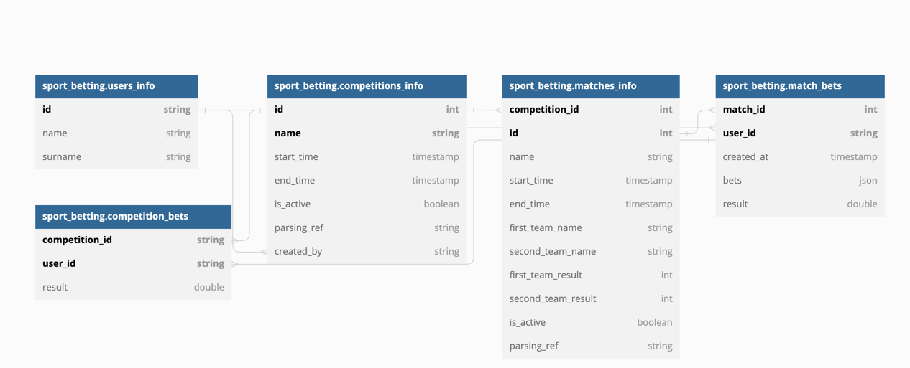

# Авторизация
Шифрование персональных данных будет происходить на уровне фронта, за персональные данные считаем telegram-ник юзера. Шифрование будет происходить за счет взятия MD5-хэша от ника, в дальнейшем по сети будет передан именно он. За айдишник пользователя считаем хэш от телеграм ника, считаем что бэк умеет доставать из хэша телеграм ник
## Ручки
```
/user/register:
        post:
            description: Регистрирует пользователя с заданными данными.
            parameters:
              - in: body
                name: body
                required: true
                schema:
                    $ref: '#/definitions/UserInfo'
            responses:
                '200':
                    description: Удачная попытка регистрации
                '400':
                    description: Ошибка при валидации параметров (например, попытка повторной регистрации)
                    schema:
                        $ref: '#/definitions/ErrorResponse'
                        
/user/login:
        post:
            description: Залогинивает пользователя с заданными данными.
            parameters:
              - in: body
                name: body
                required: true
                schema:
                    $ref: '#/definitions/BaseUserInfo'
            responses:
                '200':
                    description: Удачная попытка логина
                '400':
                    description: Ошибка при валидации параметров
                    schema:
                        $ref: '#/definitions/ErrorResponse'
                '404':
                    description: Пользователь не найден
                    schema:
                        $ref: '#/definitions/ErrorResponse'
                        
/user/register/approve:
        post:
            description: Подтверждает регистрацию пользователя (страница с вводом слова регистрации).
            parameters:
              - in: body
                name: body
                required: true
                schema:
                    $ref: '#/definitions/RegisterApprove'
            responses:
                '200':
                    description: Удачное подтверждение
                    schema:
                        $ref: '#/definitions/UserInfo'
                '400':
                    description: Ошибка при валидации параметров
                    schema:
                        $ref: '#/definitions/ErrorResponse'
                '404':
                    description: Неверное кодовое слово
                    schema:
                        $ref: '#/definitions/ErrorResponse'
                        
/user:
        put:
            description: Изменение информации о пользователе.
            parameters:
              - in: body
                name: body
                required: true
                schema:
                    $ref: '#/definitions/UserMeta'
              - in: query
                name: id
                required: true
            responses:
                '200':
                    description: Удачное изменение
                    schema:
                        $ref: '#/definitions/UserInfo'
                '400':
                    description: Ошибка при валидации параметров
                    schema:
                        $ref: '#/definitions/ErrorResponse'
                '404':
                    description: Пользователь не найден
                    schema:
                        $ref: '#/definitions/ErrorResponse'
                        
        get:
            description: Выдача информации о пользователе
            parameters:
              - in: query
                name: id
                required: true
            responses:
                '200':
                    schema:
                        $ref: '#/definitions/UserInfo'
                '400':
                    description: Ошибка при валидации параметров
                    schema:
                        $ref: '#/definitions/ErrorResponse'
                '404':
                    description: Пользователь не найден
                    schema:
                        $ref: '#/definitions/ErrorResponse'
definitions:
       UserMeta:
           type: object
           required:
             - password
           properties:
               name:
                   type: string
               surname:
                   type: string
               password:
                   type: string

       UserInfo:
           type: object
           required:
             - user_meta
             - id
           properties:
               user_meta:
                   $ref: '#/definitions/UserMeta'
               id:
                   type: string
                   
       BaseUserInfo:
           type: object
           required:
             - id
             - password
           properties:
               id:
                   type: string
               password:
                   type: string
                   
       RegisterApprove:
           type: object
           required:
             - secret_code
             - id
           properties:
               id:
                   type: string
               secret_code:
                   type: string
                   
       ErrorResponse:
           type: object
           required:
             - code
             - text
           properties:
               code:
                   type: string
               text:
                   type: string 
```
## Схема базы данных

https://dbdiagram.io/d/63b33f527d39e42284e8820d
```
Table sport_betting.users_info {
  id string [unique, not null]
  name string
  surname string
  Indexes {
    (id) [pk]
  }
}

Table sport_betting.private_users_info {
  id string [unique, not null, ref: > sport_betting.users_info.id]
  password string [not null]
  Indexes {
    (id) [pk]
  }
}

Table sport_betting.codes {
  id string [unique, not null, ref: > sport_betting.users_info.id]
  created_at timestamp [default: `now()`]
  secret_code string [not null]
  Indexes {
    (id) [pk]
  }
}
```
## Соотношение клиентского вида и бэкенд действий
Со стороны пользователя процесс регистрации выглядит следующим образом:
1) На начальной странице пользователю будет предложена форма с возможностью ввода имени, фамилии и телеграм-ника. При вводе пользователем этих данных, его телеграм-ник будет подвержен шифрованию. Далее будет дернута ручка /user/register. Пользователя перенес на следующую страницу. Логика внутри ручки сделает запись в базу sport_betting.users_info с данными пользователя.
2) На данной странице пользователю будет предложена ссылка на телеграм-бота и будет выдано одно окно, в которое пользователь должен будет ввести выданное ботом секретное слово регистрации. У бота будет работать две команды: /start - для разрешения пользователю получений сообщений от бота и /get_code - после ввода второй команды пользователю будет выдано секретное слово, которое он должен будет ввести на странице регистрации. Бот внутри себя содержит под второй командой генерацию самого секретного слова и делания запись во вторую таблицу - sport_betting.codes. При введении кода на странице пользователем будет дергаться ручка /user/register/approve, доставаться последнее сгеренной для пользователя слово из таблицы с кодами и сверяться с тем, что ввел пользователь. Если записи совпадают, то будет сделана запись в sport_betting.private_users_info. Только с этого момента пользователь считается зарегистрированным
3) Пользователь по интерейфейсу может посмотреть информацию о себе - при переходе на данную страницу будет дергаться ручка /user (get) и на той же странице менять мета-информацию о себе с помощью метода put. 
4) Пользователь помимо регистрации имеет возможность входа благодаря паролю и айди через соотвсетвующую ручку (/user/login) и соотвествующую страницу, проверять наличие такого пользователя будем через нахождение соответствующей записи в таблице sport_betting.private_users_info
5) Считаем, что телеграм-ник является неизменным для пользователя и единственным однозначным идентификатором

# Соревнования
Вступление в соревнования будет работать по ссылке. Только создатель соревнования может сам поделиться ей с друзьями и  только так пользователь может вступить в него.
## Парсер
Подобновлять инфу с ссылок для парсинга будем раз в день, обновляем инфу о соревнованиях до момента завершения всех матчей соревнования, матчей - до момент авыставления счета. Проходимся по всем соревнованиям и матчам таблицы, где is_active == true и если что обновляем записи. При дергании ручек где есть фильтры по активности мероприятия так же обновляем инфу о всех мероприятиях
## Ручки
```
/competitions:
        get:
            description: Получает все соревнования пользователя.
            parameters:
              - in: query
                name: id
                required: true
                schema:
                    type: string
            responses:
                '200':
                    schema:
                        type: object
                        required:
                          - competitions
                        properties:
                            competitions:
                                type: array
                                items:
                                    $ref: '#/definitions/Competition'
                '400':
                    description: Ошибка при валидации параметров
                    schema:
                        $ref: '#/definitions/ErrorResponse'
                '404':
                    description: Пользователь не найден
                    schema:
                        $ref: '#/definitions/ErrorResponse'
                        
/competitions_info:
        post:
            description: Добавляет пользователя в участие в соревнование.
            parameters:
              - in: query
                name: competition_id
                required: true
                schema:
                    type: string
              - in: query
                name: id
                required: true
                schema:
                    type: string
            responses:
                '200':
                    schema:
                        $ref: '#/definitions/Competition'
                '400':
                    description: Ошибка при валидации параметров
                    schema:
                        $ref: '#/definitions/ErrorResponse'
                '404':
                    description: Пользователь или соревнование не найдены
                    schema:
                        $ref: '#/definitions/ErrorResponse'
        get:
            description: Отдает информаицю о соревновании для этого пользовтеля.
            parameters:
              - in: query
                name: competition_id
                required: true
                schema:
                    type: string
              - in: query
                name: id
                required: true
                schema:
                    type: string
            responses:
                '200':
                    schema:
                        $ref: '#/definitions/Competition'
                '400':
                    description: Ошибка при валидации параметров
                    schema:
                        $ref: '#/definitions/ErrorResponse'
                '404':
                    description: Пользователь или соревнование не найдены
                    schema:
                        $ref: '#/definitions/ErrorResponse'
                        
/match_info:
        get:
            description: Отдает информаицю о матче для этого пользовтеля.
            parameters:
              - in: query
                name: match_id
                required: true
                schema:
                    type: string
              - in: query
                name: id
                required: true
                schema:
                    type: string
            responses:
                '200':
                    schema:
                        $ref: '#/definitions/Match'
                '400':
                    description: Ошибка при валидации параметров
                    schema:
                        $ref: '#/definitions/ErrorResponse'
                '404':
                    description: Пользователь или соревнование не найдены
                    schema:
                        $ref: '#/definitions/ErrorResponse'
definitions:
       Match:
           type: object
           required:
             - id
             - name
             - first_team_result
             - second_team_result
             - first_team_name
             - second_team_name
           properties:
               id:
                   type: integer
               name:
                   type: string
               first_team_name:
                   type: string
               second_team_name:
                   type: string
               first_team_result:
                   type: integer
               second_team_result:
                   type: integer
               bets_result:
                   type: double
               user_bets:
                   type: array
                   items:
                       $ref: '#/definitions/Bets'

       Competition:
           type: object
           required:
             - name
             - id
             - is_active
             - matches
           properties:
               name:
                   type: string
               id:
                   type: integer
               is_active:
                   type: boolean
               matches:
                   type: array
                   items:
                       $ref: '#/definitions/Match'
               leader_board:
                   type: array
                   items:
                       #ref: '#/definitions/BetsResult'
       
       Bets:
           type: object
           required:
             - name
             - bet
           properties:
               name:
                   type: string
               bet:
                   type: integer
               bet_profit:
                   type: double
           
       BetsResult:
           type: object
           required:
             - user_id
             - result
           properties:
               user_id:
                   type: string
               result:
                   type: double
               bets:
                   type: array
                   items:
                       $ref: '#/definitions/Bets'
           
           
                       
                    
           
```
## Схема базы данных

https://dbdiagram.io/d/63b33edc7d39e42284e881f7
```
Table sport_betting.users_info {
  id string [unique, not null]
  name string
  surname string
  Indexes {
    (id) [pk]
  }
}

Table sport_betting.competitions_info {
  id int [unique, not null, increment]
  name string [not null]
  start_time timestamp [not null]
  end_time timestamp
  is_active boolean [default: true]
  parsing_ref string [not null]
  created_by string [not null, ref: > sport_betting.users_info.id]
  Indexes {
    (id, name) [pk]
  }
}

Table sport_betting.matches_info {
  competition_id int [unique, not null, ref: > sport_betting.competitions_info.id]
  id int [unique, not null, increment]
  name string [not null]
  start_time timestamp [not null]
  end_time timestamp
  first_team_name string [not null]
  second_team_name string [not null]
  first_team_result int
  second_team_result int
  is_active boolean [default: true]
  parsing_ref string
  Indexes {
    (competition_id, id) [pk]
  }
}

Table sport_betting.match_bets {
  match_id int [unique, not null, ref: > sport_betting.matches_info.id]
  user_id string [unique, not null, ref: > sport_betting.users_info.id]
  created_at timestamp [default: `now()`]
  bets json [not null]
  result double
  Indexes {
    (match_id, user_id) [pk]
  }
}

Table sport_betting.competition_bets {
  competition_id string [unique, not null, ref: > sport_betting.competitions_info.id]
  user_id string [unique, not null, ref: > sport_betting.match_bets.user_id]
  result double
  Indexes {
    (competition_id, user_id) [pk]
  }
}
```
## Соотношение клиентского вида и бэкенд действий